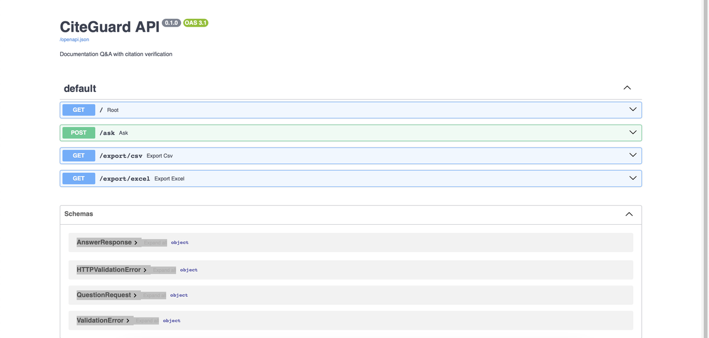
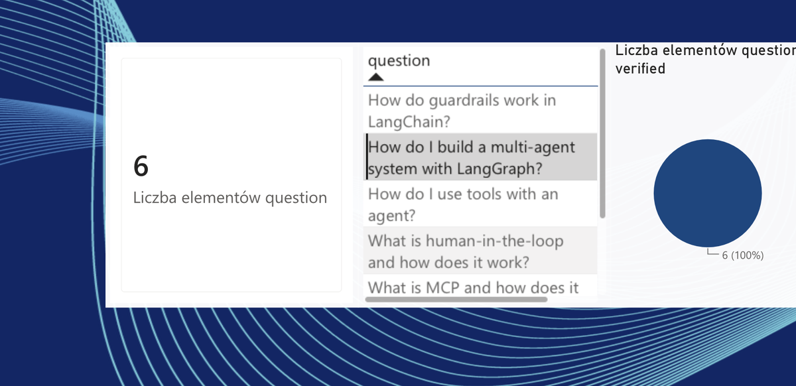

# CiteGuard

**A documentation Q&A system that checks its own answers before you have to.**

CiteGuard answers questions about LangChain/LangGraph documentation using retrieval-augmented generation (RAG) — but instead of trusting the generated answer blindly, it runs a second, independent verification step that checks whether every claim in the answer is actually grounded in the retrieved source documents. If the model hallucinates, CiteGuard flags it.

**The application includes:** agentic AI pipeline powered by an LLM (OpenAI), a FastAPI backend deployed on Azure, SQLite storage with SQL-based analytics, and a Power BI dashboard for analyzing results.


🔗 **Live API (Swagger UI):** [citeguard-api-fdc5hxd0asbhbhee.polandcentral-01.azurewebsites.net/docs](https://citeguard-api-fdc5hxd0asbhbhee.polandcentral-01.azurewebsites.net/docs) — deployed on Azure App Service, try `/ask` directly, no setup required.
🔗 **Source:** [github.com/adulamaciej/CiteGuard](https://github.com/adulamaciej/CiteGuard)

---

## Screenshots

**Live API, deployed on Azure:**



**Analytics dashboard (Power BI), built from exported query logs:**



---

## How it works

```
question
   │
   ▼
┌─────────────┐   20 candidate chunks (vector similarity search, ChromaDB)
│  retrieve   │
└──────┬──────┘
       ▼
┌─────────────┐   top 4 chunks (cross-encoder re-scoring, Hugging Face)
│   rerank    │
└──────┬──────┘
       ▼
┌─────────────┐   answer generated strictly from the 4 chunks above
│   answer    │
└──────┬──────┘
       ▼
┌─────────────┐   independent LLM check: is every claim actually
│   verify    │   supported by the source chunks?
└──────┬──────┘
       ▼
{ answer, verified: true/false, reasoning }
```

The pipeline is orchestrated as a [LangGraph](https://github.com/langchain-ai/langgraph) state graph with four nodes, each backed by its own module:

| Step | Module | What it does |
|---|---|---|
| Retrieve | `rag/retriever.py` | Vector similarity search over a ChromaDB index of LangChain's documentation |
| Rerank | `rag/reranker.py` | Re-scores candidates with a Hugging Face cross-encoder (`cross-encoder/ms-marco-MiniLM-L-6-v2`) for higher precision than vector search alone |
| Answer | `agents/answer_agent.py` | Generates an answer using only the reranked context — explicitly instructed to say "I don't know" rather than guess |
| Verify | `agents/citation_checker_agent.py` | A second LLM pass that fact-checks the generated answer against the same source chunks and flags unsupported claims |

**Important distinction:** `verified: true` means *no hallucinations were detected* — it does not mean the answer was useful. An honest "I can't answer this from the provided context" is just as "verified" as a detailed, well-grounded answer. That's by design: the verification step checks faithfulness to sources, not answer quality.

---

## Tech stack

- **Orchestration:** LangGraph, LangChain
- **LLM:** OpenAI (`gpt-5-mini`) for both answer generation and citation checking
- **Retrieval:** ChromaDB (vector store), OpenAI embeddings (`text-embedding-3-small`)
- **Reranking:** Hugging Face `sentence-transformers` cross-encoder
- **API:** FastAPI + Uvicorn, with structured logging and error handling on external LLM calls
- **Observability:** LangSmith (distributed tracing across all four pipeline steps)
- **Storage:** SQLite for logging every query, with SQL aggregation queries for stats
- **Data export:** CSV / Excel export of every logged query, built for downstream analysis in Power BI

---

## Project structure

```
CiteGuard/
├── api/
│   └── main.py                  # FastAPI app — entry point
├── agents/
│   ├── answer_agent.py          # Generates answers from context
│   └── citation_checker_agent.py # Verifies answers against sources
├── rag/
│   ├── indexer.py               # Builds the ChromaDB index from docs
│   ├── retriever.py             # Vector similarity search
│   └── reranker.py              # Cross-encoder reranking
├── graph/
│   └── workflow.py              # LangGraph pipeline definition
├── utils/
│   └── results_logger.py        # Appends each query to a CSV log
├── config.py                    # Paths and shared configuration
└── requirements.txt
```

---

## Setup

### 1. Clone this repo and the LangChain docs source

CiteGuard indexes LangChain's own documentation. The docs source isn't bundled in this repo (it's a full external repo) — clone it separately into the project root:

```bash
git clone https://github.com/langchain-ai/docs.git docs
```

### 2. Create a virtual environment and install dependencies

```bash
python -m venv venv
source venv/bin/activate
pip install -r requirements.txt
```

### 3. Set environment variables

Create a `.env` file in the project root:

```
OPENAI_API_KEY=your_openai_key
LANGSMITH_TRACING=true
LANGSMITH_API_KEY=your_langsmith_key
LANGSMITH_PROJECT=citeguard
```

(LangSmith variables are optional — the app runs without them, you just won't get tracing.)

### 4. Build the vector index

This reads the `.mdx` files from `langchain-source/`, chunks them, embeds them, and writes them to ChromaDB. Run it once, and again any time the docs change:

```bash
python rag/indexer.py
```

### 5. Run the API

```bash
cd api
uvicorn main:app --reload
```

Visit `http://127.0.0.1:8000/docs` for the interactive Swagger UI.

---

## API endpoints

| Endpoint | Method | Description |
|---|---|---|
| `/` | GET | Health check |
| `/ask` | POST | Ask a question — returns `answer`, `verified`, `reasoning` |
| `/stats` | GET | Aggregate stats (count, avg answer length) grouped by verification status, via SQL |
| `/export/csv` | GET | Download the full query log as CSV |
| `/export/excel` | GET | Download the full query log as Excel |


Example request:

```bash
curl -X POST http://127.0.0.1:8000/ask \
  -H "Content-Type: application/json" \
  -d '{"question": "How do I build a multi-agent system with LangGraph?"}'
```

---

## Data export & analysis

Every call to `/ask` is logged (question, answer, verified status, reasoning, timestamp) to a local SQLite database. The `/export/excel` endpoint converts this into a spreadsheet ready to drop into Power BI, Excel, or any BI tool — useful for tracking things like verification rate over time or which topics the system struggles with. See the dashboard screenshot above for an example built directly from this export.

---

## Notes on design decisions

- **Two-stage retrieval (vector search + reranking):** vector similarity alone often returns chunks that are topically related but don't actually answer the question. Reranking with a cross-encoder — which scores the query and chunk together, rather than as independent vectors — meaningfully improves precision before the chunks reach the LLM.
- **Separate answer and verification models/prompts:** using an independent pass to check citations (rather than asking the same call to "be careful") catches errors the generating model is otherwise blind to, since it isn't re-reading its own output critically.
- **Fail-safe prompting:** the answer agent is explicitly instructed to say it can't answer rather than fill gaps with general knowledge — this keeps the verification step meaningful instead of chasing plausible-sounding but ungrounded text.
- **Graceful degradation on external failures:** if the OpenAI or Hugging Face calls fail mid-pipeline, `/ask` returns a clear 502 error instead of a raw stack trace, and a logging failure never blocks the response from reaching the user. Structured logging (via Python's `logging` module) traces each request through retrieval, reranking, answering, and verification.

---